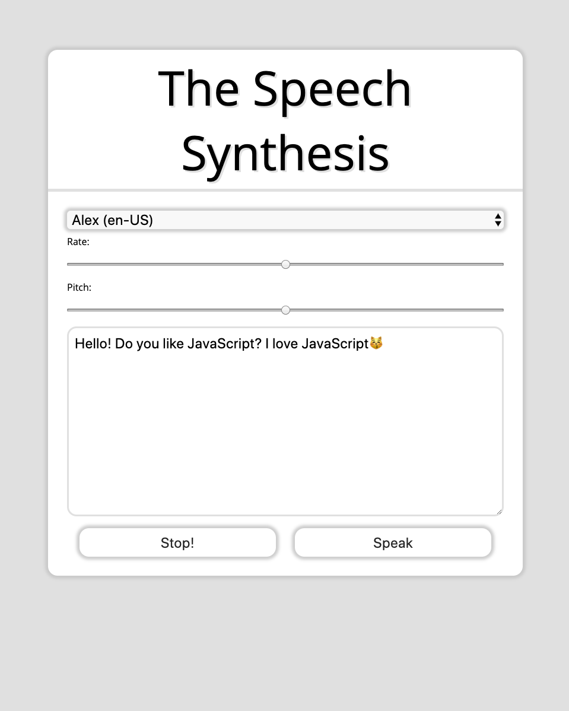
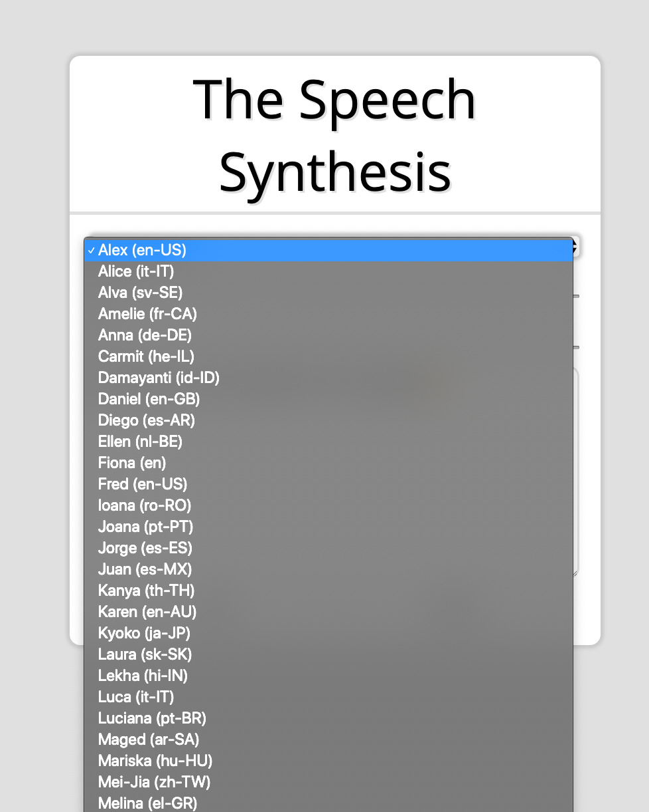

# 23. Speech Synthesis

#### _Speech Synthesis by JavaScript30 10/25/19_

## Description
This is Speech Synthesis, 23rd application out of 30 by 30 day Vanilla JavaScript Coding Challenge by Wes Bos.<br>
Please check the challenge from [JavaScript30](http://wesbos.com/javascript30/).




## About this Application
- Use `speechSynthesis` API and read the text in the textarea.

- User can choose the voice.


- User can change the voice rate and pitch.

- User can edit the text area.

- The emoji will be read in its native language.

## Setup/Installation

1. Clone this repo:
```
$ git clone https://github.com/misakimichy/JS30-23-speech-synthesis.git
```

2. Navigate to the top level of the cloned directory.

3. Open index.html with your preferred web browser.

## Known Bugs
* No known bugs at this time.

## Support and contact details
 I welcome any feedbacks and comments: misaki.koonce@gmail.com

## Technologies Used
_Git, GitHub, HTML, CSS, Vanilla JavaScript

## License
Copyright © 2019 under the MIT License